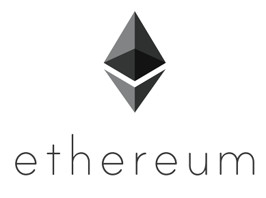
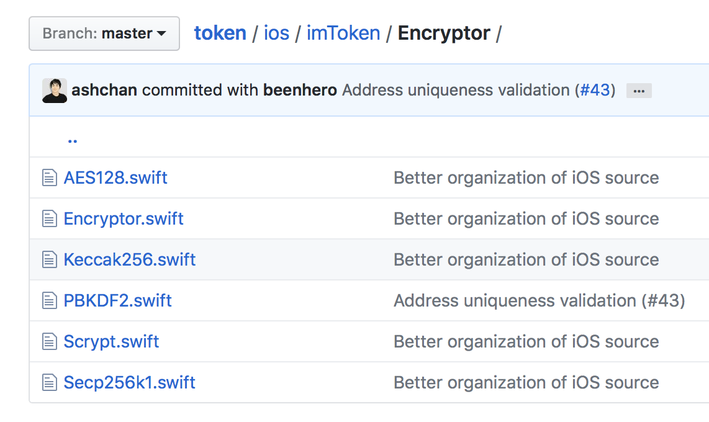
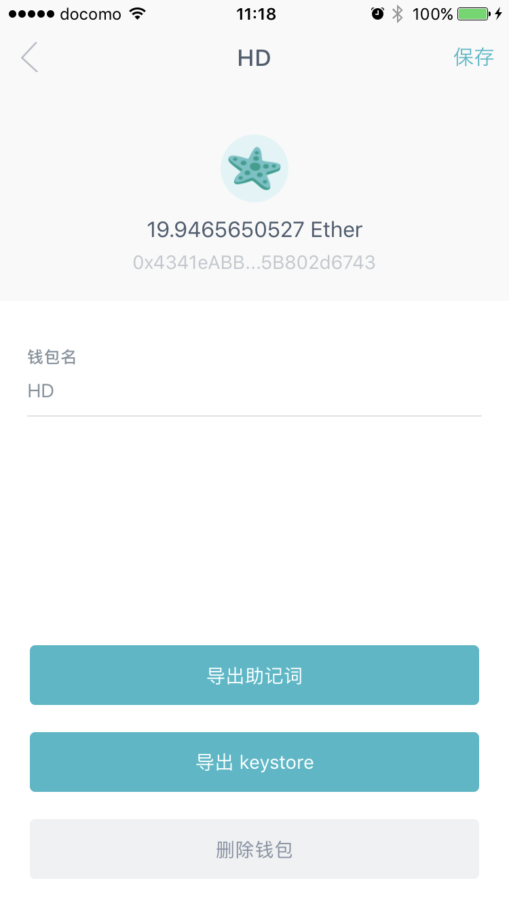

autoscale: true
theme: Courier, 6
footer: 比特币、以太坊的加密技术
slidenumbers: true
slidecount: true


[.hide-footer]
[.slidenumbers: false]
# [fit] 比特币、以太坊的加密技术

## [fit] Cryptography for Bitcoin/Ethereum




<br><br><br>

陈建明 (@ashchan)
2017-05-21 @ 亿咖啡

---

## 数字加密货币

> `CryptoCurrency`

Bitcoin, Ethereum, ...

加密技术是数字加密货币（区块链技术）的基石。


^ 没有这些加密技术的支持，区块链技术将会崩坏。

---

## 何谓加解密？

简单的说，**加密**：将**明文**(plaintext)转换成**密文**(ciphertext)的过程。**解密**：将密文转换回明文的过程。

$$
加密(plaintext) = ciphertext
$$

### 组成部分

* 算法
* 密钥

---

[.build-lists: true]
## 加密技术的主要关注点

* 信息（明文）的保密
* 信息完整性验证
* 信息发布的不可抵赖性（数字签名）


^ 信息完整性验证: 传递过程中不丢信息（失真）

^ 信息发布的不可抵赖性：接收方可以验证发送方身份

---

### 加密技术分类

* **对称加密**
	- 双方共享**密钥（码）**(secret key,あんごう)，加密传输基于密钥安全而非算法安全。
	- 加密与解密使用同一算法。
	- 破解难度主要取决于密钥复杂度。
* **非对称加密**（公开密钥加密）
	- 使用密钥对（公钥 publickey、私钥 privatekey）。
	- 不传递**私钥**。
	- 加解密可能使用多种规则和算法。
	- 安全性既不依赖算法的保密，也不依赖于传递密钥的途径。


^ 对称加密的密钥，确切的说是密码，它并不一定要是密钥格式的。

---

## 加密技术：对称加密

* 加解密使用相同的密钥。
* 双方需要知道密钥，密钥传递不方便，容易泄露。
* 多方之间交换信息，需要多个密钥。

假设明文为 p = Hello，密钥为 s = secret, 密文为 c = a^%$#@!。

$$
加密(p, s) = c
$$

$$
解密(c, s) = p
$$

---

## 加密技术：非对称加密

* 公钥可以向任何人公布。
* 仅自己持有私钥。
* 私钥签名的密文可以用公钥验证；公钥加密的密文可以用私钥解密。
* **不可能**从公钥逆向推算出私钥。

### Example

**SSH**，RSA 算法，基于两个大素数的乘积。上传 publickey 至服务器。

---

## 加密技术：非对称加密

### 柯克霍夫原則（Kerckhoffs' principle）

> A cryptosystem should be secure even if everything about the system, except the key, is public knowledge.
-- Auguste Kerckhoffs

密码系统就算被所有人知道其运作步骤，（只要私钥不泄漏，）仍然是安全的。


^ 破解难度取决于私钥长度。以RSA算法为例，目前几乎无法对稍微长点的私钥加密的内容进行暴力破解。

---

## 比特币和以太坊加密技术
大量使用对称加密和非对称加密，以及相关技术。

* 加密、解密（如上述）
* Hash、Message digest（哈希，SHA256, RIPEMD160）
* Checksum（校验和）
* 编码（Base64，Base58）


^ Hash: 摘要，对不定长度的数据进行换算，计算出固定长度的不容易冲突的结果。

^ Checksum：校验和，对数据进行冗余校验和完整性检查。

^ 编码：将二进制数据转化为普通字符，更易于阅读和判别。

---
 
## 比特币及其加密技术

* 私钥：32字节
* 公钥：65字节，由私钥计算得来
* 地址（**`13yfsYAzjvH4kCR13rwTrq2iigYKJeiHFw`**） （Base 58，长度34个字符，其实就是公钥的摘要）
* 钱包（保存、管理私钥，签名交易，发送接受转账；相当于银行账号）

---

## 比特币私钥

`18E14A7B6A307F426A94F8114701E7C8E774E7F9A47E2C2035DB29A206321725`

* 32字节（unsigned 256 bit）
* 随机数
* 重要！重要！重要！数字资产，保密。
 
 
^ 私钥或助记词，无密码保护的原始数据。失去私钥，就失去了一切。

^ 自己管理私钥（钱包），国家无法禁止你转账（提币）。

---

## 比特币公钥

* 压缩形式，33位，前缀为`0x02`或`0x03` (`0x02` + x)
* 未压缩形式，65位，前缀位 `0x04` (`0x04` + x + y)

**04**50863AD64A87AE8A2FE83C1AF1A8403CB53F53E486D8511DAD8A04887E5B2352**2CD470243453A299FA9E77237716103ABC11A1DF38855ED6F2EE187E9C582BA6**

### 计算摘要

 ```swift
 let hash = SHA256(publickey) // 32字节
 // => 600FFE422B4E00731A59557A5CCA46CC183944191006324A447BDB2D98D4B408
 let data = RIPEMD160(hash) // 公钥 Hash160，20字节，减少数据传输量
 // => 010966776006953D5567439E5E39F86A0D273BEE
 ```

---

## 比特币地址

* `13yfsYAzjvH4kCR13rwTrq2iigYKJeiHFw`，1 开头
* `3J98t1WpEZ73CNmQviecrnyiWrnqRhWNLy`，3 开头，Multi-signature，由多个私钥生成

注：以下都用1开头的老地址为例

---

## 比特币地址


Source: https://en.bitcoin.it/wiki/File:PubKeyToAddr.png

---

## 比特币地址

由公钥推导而来。
 
 ```swift, [.highlight: 1-2]
 let prefix = "00" // 版本，0x00 for Main Network
 let data = "0109667760069..." // 公钥 Hash160 摘要
 let hash = SHA256(SHA256(prefix + data))
 let checksum = hash.prefix(4字节) // => D61967F6
 let address = Base56(prefix + data + checksum)
 // => 16UwLL9Risc3QfPqBUvKofHmBQ7wMtjvM
 ```
 ---

## 比特币地址
 
 ```swift, [.highlight: 3-4]
 let prefix = "00" // 版本，0x00 for Main Network
 let data = "0109667760069..." // 公钥 Hash160 摘要
 let hash = SHA256(SHA256(prefix + data))
 let checksum = hash.prefix(4字节) // => D61967F6
 let address = Base56(prefix + data + checksum)
 // => 16UwLL9Risc3QfPqBUvKofHmBQ7wMtjvM
 ```
 ---

## 比特币地址
 
 ```swift, [.highlight: 5-6]
 let prefix = "00" // 版本，0x00 for Main Network
 let data = "0109667760069..." // 公钥 Hash160 摘要
 let hash = SHA256(SHA256(prefix + data))
 let checksum = hash.prefix(4字节) // => D61967F6
 let address = Base56(prefix + data + checksum)
 // => 16UwLL9Risc3QfPqBUvKofHmBQ7wMtjvM
 ```
 
---

## 以太坊及其加密技术

站在巨人 Bitcoin 肩膀上，使用了 Bitcoin 的许多相关加密算法和技术。

* 私钥（及助记词 Mnemonic）
* 公钥
* 地址
	* **`0x8E552aE4Edd69832d98d7AAeC6611Cc0a90c4C55`**
	* 十六进制, 不包含0x长度40
* 钱包（deterministic wallets） 

---

## 以太坊加密算法



* 前述 Bitcoin 使用的大部分算法
* PBKDF2
* Scrypt
* Secp256k1
* Keccak256
* AES128
  
---
 
## 以太坊私钥及助记词

### 助记词（mnemonic）

* 12个（或更多个）英文（或其他语言）单词
* Seed: 种子，经 SHA256 Hash 运算后，以它为 index 从词典里随机取出12个单词即为助记词
* 助记词推导 Seed：配合一个用户指定的密码，使用 PBKDF2 和 HMAC-SHA512 算法计算出种子
* Bitcoin 提案 BIP39，BIP32

See https://github.com/bitcoin/bips/blob/master/bip-0039.mediawiki & https://github.com/bitcoin/bips/blob/master/bip-0032.mediawiki
 
---

[.build-lists: true]
## 👉豆知识：保护以太坊资产



采用以下一种或多种措施

* 记录并保护好**私钥**
* 记录并保护好**助记词**
* 导出钱包文件（**keystore**）并牢记密码
* 注：大部分钱包软件包括 imToken 在内不支持导出私钥。


^ 助记词与私钥等价，都没有任何保护。

^ 私钥不容易记录，助记词很好的解决了这个问题。

^ 钱包文件的密码一定不能忘记。

---

## 以太坊私钱包

* `HD` (Hierarchical deterministic wallets)
* `V3` (官方格式第3版)
* 包含数据：
	* 指定（对称）加密算法
	* 加密参数
	* 私钥的密文
	* 地址（可以不包含）

简单解析一下 V3 格式

---

### 以太坊 V3 钱包

```javascript, [.highlight: 19]
{
    "crypto" : {
        "cipher" : "aes-128-ctr",
        "cipherparams" : {
            "iv" : "6087dab2f9fdbbfaddc31a909735c1e6"
        },
        "ciphertext" : "5318b4d5bcd28de64ee5559e671353e16f075ecae9f99c7a79a38af5f869aa46",
        "kdf" : "pbkdf2",
        "kdfparams" : {
            "c" : 262144,
            "dklen" : 32,
            "prf" : "hmac-sha256",
            "salt" : "ae3cd4e7013836a3df6bd7241b12db061dbe2c6785853cce422d148a624ce0bd"
        },
        "mac" : "517ead924a9d0dc3124507e3393d175ce3ff7c1e96529c6c555ce9e51205e9b2"
    },
    "id" : "3198bc9c-6672-5ab3-d995-4942343ae5b6",
    "address" : 8e552ae4edd69832d98d7aaec6611cc0a90c4c55,
    "version" : 3
}
```
---

### 以太坊 V3 钱包

```javascript, [.highlight: 8]
{
    "crypto" : {
        "cipher" : "aes-128-ctr",
        "cipherparams" : {
            "iv" : "6087dab2f9fdbbfaddc31a909735c1e6"
        },
        "ciphertext" : "5318b4d5bcd28de64ee5559e671353e16f075ecae9f99c7a79a38af5f869aa46",
        "kdf" : "pbkdf2", // pbkdf2 或 scrypt
        "kdfparams" : {
            "c" : 262144,
            "dklen" : 32,
            "prf" : "hmac-sha256",
            "salt" : "ae3cd4e7013836a3df6bd7241b12db061dbe2c6785853cce422d148a624ce0bd"
        },
        "mac" : "517ead924a9d0dc3124507e3393d175ce3ff7c1e96529c6c555ce9e51205e9b2"
    },
    "id" : "3198bc9c-6672-5ab3-d995-4942343ae5b6",
    "address" : 8e552ae4edd69832d98d7aaec6611cc0a90c4c55,
    "version" : 3
}
```
---

### 以太坊 V3 钱包加密密码

* `Derived key`: 根据密码、kdf 算法、kdf 参数（包含 salt）计算出。这个key 用于加解密私钥。
* `kdf`: key derivation function，pbkdf2 或 scrypt
* `kdfparams`: KDF-dependent static and dynamic parameters to the KDF function

---

### 以太坊 V3 钱包 (PBKDF2)

```javascript
{
    "crypto" : {
        "cipher" : "aes-128-ctr",
        "cipherparams" : {
            "iv" : "6087dab2f9fdbbfaddc31a909735c1e6"
        },
        "ciphertext" : "5318b4d5bcd28de64ee5559e671353e16f075ecae9f99c7a79a38af5f869aa46",
        "kdf" : "pbkdf2",
        "kdfparams" : {
            "c" : 262144,
            "dklen" : 32,
            "prf" : "hmac-sha256",
            "salt" : "ae3cd4e7013836a3df6bd7241b12db061dbe2c6785853cce422d148a624ce0bd"
        },
        "mac" : "517ead924a9d0dc3124507e3393d175ce3ff7c1e96529c6c555ce9e51205e9b2"
    },
    "id" : "3198bc9c-6672-5ab3-d995-4942343ae5b6",
    "address" : 8e552ae4edd69832d98d7aaec6611cc0a90c4c55,
    "version" : 3
}
```


^ PBKDF2: Password-Based Key Derivation Function 2。重复多次计算，增加破解难度。

---

### 以太坊 V3 钱包 (PBKDF2)

```javascript, [.highlight: 8-14]
{
    "crypto" : {
        "cipher" : "aes-128-ctr",
        "cipherparams" : {
            "iv" : "6087dab2f9fdbbfaddc31a909735c1e6"
        },
        "ciphertext" : "5318b4d5bcd28de64ee5559e671353e16f075ecae9f99c7a79a38af5f869aa46",
        "kdf" : "pbkdf2",
        "kdfparams" : {
            "c" : 262144, // Number of iterations
            "dklen" : 32, // Length for the derived key. Must be >= 32.
            "prf" : "hmac-sha256", // Must be hmac-sha256
            "salt" : "ae3cd4e7013836a3df6bd7241b12db061dbe2c6785853cce422d148a624ce0bd"
        },
        "mac" : "517ead924a9d0dc3124507e3393d175ce3ff7c1e96529c6c555ce9e51205e9b2"
    },
    "id" : "3198bc9c-6672-5ab3-d995-4942343ae5b6",
    "address" : 8e552ae4edd69832d98d7aaec6611cc0a90c4c55,
    "version" : 3
}
```

---

### 以太坊 V3 钱包 (scrypt)

```javascript
{
    "crypto" : {
        "cipher" : "aes-128-ctr",
        "cipherparams" : {
            "iv" : "83dbcc02d8ccb40e466191a123791e0e"
        },
        "ciphertext" : "d172bf743a674da9cdad04534d56926ef8358534d458fffccd4e6ad2fbde479c",
        "kdf" : "scrypt",
        "kdfparams" : {
            "dklen" : 32,
            "n" : 262144,
            "r" : 1,
            "p" : 8,
            "salt" : "ab0c7876052600dd703518d6fc3fe8984592145b591fc8fb5c6d43190334ba19"
        },
        "mac" : "2103ac29920d71da29f15d75b4a16dbe95cfd7ff8faea1056c33131d846e3097"
    },
    "id" : "3198bc9c-6672-5ab3-d995-4942343ae5b6",
    "address" : 8e552ae4edd69832d98d7aaec6611cc0a90c4c55,
    "version" : 3
}
```
---

### 以太坊 V3 钱包 (scrypt)

```javascript, [.highlight: 8-15]
{
    "crypto" : {
        "cipher" : "aes-128-ctr",
        "cipherparams" : {
            "iv" : "83dbcc02d8ccb40e466191a123791e0e"
        },
        "ciphertext" : "d172bf743a674da9cdad04534d56926ef8358534d458fffccd4e6ad2fbde479c",
        "kdf" : "scrypt",
        "kdfparams" : {
            "dklen" : 32,
            "n" : 262144, // Hashing rounds
            "r" : 1,
            "p" : 8,
            "salt" : "ab0c7876052600dd703518d6fc3fe8984592145b591fc8fb5c6d43190334ba19"
        },
        "mac" : "2103ac29920d71da29f15d75b4a16dbe95cfd7ff8faea1056c33131d846e3097"
    },
    "id" : "3198bc9c-6672-5ab3-d995-4942343ae5b6",
    "address" : 8e552ae4edd69832d98d7aaec6611cc0a90c4c55,
    "version" : 3
}
```


^ script: 特点是使用高内存，增加破解难度。

---

### 以太坊 V3 钱包创建过程

1. 设置用户密码(passphrase)
2. 生成随机私钥、salt、iv
3. 选择 KDF 算法(pbkdf2 或 scrypt)
4. 计算 ciphertext(`AES-128-CBC` 或 `AES-128-CTR`)、 mac 和 地址
5. 保存为 JSON 文件

注：私钥使用 AES 单向加密为 cipher text。

#### See

* V1 Spec: https://github.com/ethereum/go-ethereum/wiki/Passphrase-protected-key-store-spec
* V3 Spec: https://github.com/ethereum/wiki/wiki/Web3-Secret-Storage-Definition

---

### 👉豆知识：术语

* `passphrase`: 密码
* `salt`: 盐？😅 随机数据，防止针对 hash 算法的彩虹攻击
* `iv`: initialization vector
* `mac`: message authentication code
* `hmac`: hash-based message authentication code 

---

### 以太坊 V3 钱包加解密

```swift
// 加密（创建钱包）
let private_key = generate_privatekey() // 随机生成
let derived_key = kdf(passphrase, kdfprams)
let cipher_text = aes_encrypt(derived_key.first_16_bytes, iv, private_key)
// cipher: The key for the cipher is the leftmost 16 bytes of the derived key
let mac = sha3(derived_key.last_16_bytes, cipher_text)
// mac: SHA3 (keccak-256) of the concatenation of the last 16 bytes of
// the derived key together with the full ciphertext

// 解密（使用、导出钱包，转账等）
let derived_key = kdf(passphrase, kdfprams)
let private_key = aes_decrypt(derived_key.first_16_bytes, iv, cipher_text)
let mac = sha3(derived_key.last_16_bytes, cipher_text)
verify(mac) // 比较 JSON 中的 mac 值与计算出的值
```

---


### 以太坊 V3 钱包 cipher

```javascript, [.highlight: 2-7, 16-17]
{
    "crypto" : {
        "cipher" : "aes-128-ctr", // 对称加密算法。老版本仅使用 AES-128-CBC，V3 使用 AES-128-CTR 或更强算法
        "cipherparams" : {
            "iv" : "83dbcc02d8ccb40e466191a123791e0e" // 128-bit initialisation vector for the cipher.
        },
        "ciphertext" : "d172bf743a674da9cdad04534d56926ef8358534d458fffccd4e6ad2fbde479c",
        "kdf" : "scrypt",
        "kdfparams" : {
            "dklen" : 32,
            "n" : 262144,
            "r" : 1,
            "p" : 8,
            "salt" : "ab0c7876052600dd703518d6fc3fe8984592145b591fc8fb5c6d43190334ba19"
        },
        "mac" : "2103ac29920d71da29f15d75b4a16dbe95cfd7ff8faea1056c33131d846e3097"
        // SHA3 (keccak-256) of the concatenation of the last 16 bytes of the derived key together with the full ciphertext
    },
    "id" : "3198bc9c-6672-5ab3-d995-4942343ae5b6",
    "address" : 8e552ae4edd69832d98d7aaec6611cc0a90c4c55,
    "version" : 3
}
```

---

### 以太坊 V3 钱包 cipher

```javascript, [.highlight: 2-7, 16-17]
{
    "crypto" : {
        "cipher" : "aes-128-ctr", // 对称加密算法。老版本仅使用 AES-128-CBC，V3 使用 AES-128-CTR 或更强算法
        "cipherparams" : {
            "iv" : "83dbcc02d8ccb40e466191a123791e0e" // 128-bit initialisation vector for the cipher.
        },
        "ciphertext" : "d172bf743a674da9cdad04534d56926ef8358534d458fffccd4e6ad2fbde479c",
        "kdf" : "scrypt",
        "kdfparams" : {
            "dklen" : 32,
            "n" : 262144,
            "r" : 1,
            "p" : 8,
            "salt" : "ab0c7876052600dd703518d6fc3fe8984592145b591fc8fb5c6d43190334ba19"
        },
        "mac" : "2103ac29920d71da29f15d75b4a16dbe95cfd7ff8faea1056c33131d846e3097"
        // SHA3 (keccak-256) of the concatenation of the last 16 bytes of the derived key together with the full ciphertext
    },
    "id" : "3198bc9c-6672-5ab3-d995-4942343ae5b6",
    "address" : 8e552ae4edd69832d98d7aaec6611cc0a90c4c55,
    "version" : 3
}
```

---

## 👉豆知识：保护以太坊资产（续）

* 妥善保存私钥或助记词
* 妥善备份钱包文件（keystore）并牢记密码
* 私钥或助记词可以用来在任何时候导入成为钱包
* 钱包文件密码丢失便**无法**使用和恢复

---

## [fit] ありがとう
### Q&A